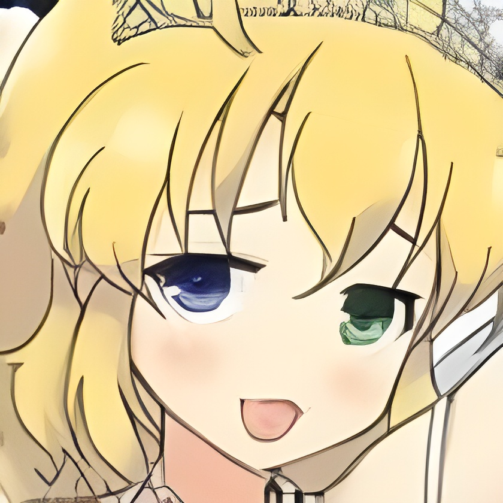

<div align="center">
  
  ### :book:  Real-ESRGAN: Training Real-World Blind Super-Resolution with Pure Synthetic Data

  > [[Paper](https://arxiv.org/abs/2107.10833)] &emsp; [[YouTube Video](https://www.youtube.com/watch?v=fxHWoDSSvSc)] &emsp; [[B站讲解](https://www.bilibili.com/video/BV1H34y1m7sS/)] &emsp; [[Poster](https://xinntao.github.io/projects/RealESRGAN_src/RealESRGAN_poster.pdf)] &emsp; [[PPT slides](https://docs.google.com/presentation/d/1QtW6Iy8rm8rGLsJ0Ldti6kP-7Qyzy6XL/edit?usp=sharing&ouid=109799856763657548160&rtpof=true&sd=true)]<br>
  > [Xintao Wang](https://xinntao.github.io/), Liangbin Xie, [Chao Dong](https://scholar.google.com.hk/citations?user=OSDCB0UAAAAJ), [Ying Shan](https://scholar.google.com/citations?user=4oXBp9UAAAAJ&hl=en) <br>
  > [Tencent ARC Lab](https://arc.tencent.com/en/ai-demos/imgRestore); Shenzhen Institutes of Advanced Technology, Chinese Academy of Sciences

  <p align="center">
    
  </p>

--- 
</div>

# Anime_Real_ESRGAN

Practical algorithms for general image/video restoration are aimed to be developed by Real-ESRGAN. The powerful ESRGAN is extended to a practical restoration application (namely, Real-ESRGAN), which is trained using purely synthetic data.

---

<br>

  > **Related Projects**：
  >
  > - [FaceRestoration_GFPGAN](https://github.com/KaiKenju/FaceRestoration_GFPGAN): leverages the powerful GFPGAN-based face restoration technology to enhance image quality, restoring facial details from blurry or low-quality images with clarity and naturalness.

<br>

---
## 👀 Demos Videos

| Input | Real-ESRGAN |
|--|--|
|  |  |
|  |  |


- Hardware Accelerators

| Single         | Original Video  Time         | Enhance Video Time| Upscale |
| ------------- | ------------- | --- | --- |
| **GPU**  | 18s | 2:46m | 4  |
|  | 18s | 1:44m | 2  |
| **CPU**     | 18s     | >3h | 2 |


# 🔧 Dependencies 
- Python >= 3.7 (Recommend to use Anaconda or Miniconda)
- PyTorch >= 1.7
- GPU (CPU very slow)
- FFmpeg environment
   1. You need to install ffmqpeg: [here](https://www.gyan.dev/ffmpeg/builds/)
   2. You can following the guide: [Guide](https://kdata.vn/tin-tuc/huong-dan-cach-cai-dat-ffmpeg-tren-windows-cuc-ky-don-gian)
   3. After that unzip file , the file `ffmpeg.exe` in the folder `bin`
   4. Open `System Properties/Environment Variable/System variables/PATH/path of ffmpeg.exe` in Window . 
   5. For example of path ffmpeg.exe: 
     ```
     C:\Users\ffmpeg-7.0.2-essentials_build\bin
     ```
# 🛠️ Installation
- Clone the project 
```
git clone https://github.com/KaiKenju/Anime_Real_ESRGAN.git
cd Anime_Real_ESRGAN
```
- Initial enviroment with Miniconda(Default python: 3.10) and requirements
```
conda create -n <env_name> python=3.10 
conda activate <env_name>
pip install -r requirements.txt
```
- Fix torchvision problem: you need to run the [fix_torchvision.py](fix_torchvision.py) to solve the problem of basicsr
```
python fix_torchvision.py
```
# ⚡ Quick Inference
There are usually two ways to inference Real-ESRGAN.
  1. [Online inference](#online-inference)
  2. [Python script](#python-script)
   
### Online inference
  1. You can try in [Google Colab](Notebooks\Video_Real_ESRGAN_Inference.ipynb) for anime video (Real-ESRGAN)
  2. Similar with [Google Colab](Notebooks\Image_Real_ESRGAN_Anime_Inference.ipynb) for anime image (RealESRGAN_x4plus)

### Python script
- With anime video
```bash
python inference_anime_video.py -i <input_video> -n realesr-animevideov3 -s 4 --suffix outx4 
```

```console
Usage: python inference_anime_video.py -i input/video/Tesla_animation.mp4 -n realesr-animevideov3 -s 2 --suffix outx2 

  -h                   show this help
  -i --input           Input video . Default: inputs
  -o --output          Output folder. Default: results
  -n --model_name      Model name. Default: realesr-animevideov3
  -s, --outscale       The final upsampling scale of the image (1,2,3,4). Default: 4
  --suffix             Suffix of the restored image. Default: out
  -t, --tile           Tile size, 0 for no tile during testing. Default: 0
  --face_enhance       Whether to use GFPGAN to enhance face. Default: False
  --fp32               Use fp32 precision during inference. Default: fp16 (half precision).
  --ext                Image extension. Options: auto | jpg | png, auto means using the same extension as inputs. Default: auto
```

- With anime image
```bash
python inference_anime_image.py -n RealESRGAN_x4plus -i input/image/ -o output_image --outscale 3.5 --face_enhance
```
```console
A common command: python inference_realesrgan.py -n RealESRGAN_x4plus -i infile --outscale 3.5 --face_enhance

  -h                   show this help
  -i --input           Input image or folder. Default: inputs
  -o --output          Output folder. Default: results
  -n --model_name      Model name. Default: RealESRGAN_x4plus
  -s, --outscale       The final upsampling scale of the image. Default: 4
  --suffix             Suffix of the restored image. Default: out
  -t, --tile           Tile size, 0 for no tile during testing. Default: 0
  --face_enhance       Whether to use GFPGAN to enhance face. Default: False
  --fp32               Use fp32 precision during inference. Default: fp16 (half precision).
  --ext                Image extension. Options: auto | jpg | png, auto means using the same extension as inputs. Default: auto
```
Results are in the `output_image` folder
| Input | Real-ESRGAN |
|--|--|
|  |  |
|  |  |
|  |  |


We have provided five models:

1. realesrgan-x4plus  (default)
2. realesrnet-x4plus
3. realesrgan-x4plus-anime (optimized for anime images, small model size)
4. realesr-animevideov3 (animation video)
5. RealESRGAN_x4plus_anime_6B
   
## Model Comparison

| **Model Name**                      | **Key Features**                | **Use Cases**                      |
|-------------------------------------|----------------------------------|------------------------------------|
| **RealESRGAN-x4plus** (Default)    | - 4x Upscaling ,Detail balance  | - General enhancement , Various image types|
| **RealESRNet-x4plus**              | - Non-GAN,Fewer artifacts       | - Fast processing                   |
| **RealESRGAN-x4plus-anime**        | - Anime optimization,Smaller size | - Anime upscaling                  |
| **RealESR-AnimeVideoV3**           | - Anime video focus,Flicker reduction| - Temporal consistency          |
| **RealESRGAN_x4plus_anime_6B**     | - High-detail anime, More computationally heavy| - Complex scene enhancement |


**Tips**

The first time you run the model and use CPU, it can be more time to load data, so to reduce time you can put weight file following path:
1. Download pre-trained models and other data. Put them in the `anime_real_esrgan/gfpgan/weights` folder.
    1. [Detection_Resnet50](https://drive.google.com/file/d/1xrJsMbCZMfn7ovumCBmhlp9VVs2rIJ1z/view?usp=drive_link)
    2. [Parsing_Parsenet](https://drive.google.com/file/d/1WprE4914U3MYiU6p6oVjVRm_tCs4lsY_/view?usp=drive_link)
2. Also in the `/weights` folder.
    1. [RealESRGAN_x4](https://github.com/xinntao/Real-ESRGAN/releases/download/v0.1.0/RealESRGAN_x4plus.pth)

For a smoother experience and better performance, I recommend using a GPU for the entire model to avoid unnecessary delays and save time.